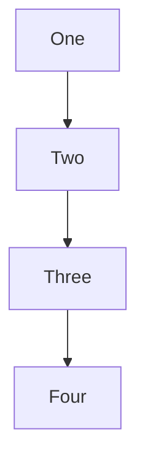

<h1 align="center">$\color{#ff3d6a}{\textsf{Синтаксис Python}}$</h1>


> Основная часть программы
> Комментарии 
> Переменные
>> Типы данных
>> Объявление константы 
>> Определить тип
>> Определить идентификатор объекта (хэш код)

> Операции с переменными
>> Ввод переменных
>> Преобразование типов данных
>> Вывод переменных
>> Удаление переменной
>> Операции с числами
>> Операции с числами модуль math
>> Операции над строками
> Списки (list)
> Кортежи (tuple)
> Словари (dict)
> Логика
>> Операторы сравнения
>> Логические операторы
>> Ветвление
>> Каскадные условные инструкции if... elif... else:
>> Цикл while «пока»
>> Цикл for 
> Функции
>> Спецификация функции
> Свой модуль для python
	

<h1 align="center">Тест readme</h1>

<h2 id="title1" align="center">Тест readme </h2>

<h3 align="center">Тест readme </h3>

# Тест readme

## <p id="title2">Тест readme</p>

### Тест readme

# $\color{#ff3d6a}{\textsf{Заголовок цвет}}$

<h2 align="center">$\color{#ff3d6a}{\textsf{Заголовок цвет}}$</h2>

$\color{brown}{\textsf{Text Color 1}}$

$\textcolor{red}{\textsf{Text Color 2}}$

$\color{#ff3d6a}{\textsf{Text Color 3}}$

$\color{rgb(255,132,61)}{\textsf{Text Color 4}}$

$\color{rgba(255,236,61, 0.6)}{\textsf{Text Color 5}}$

$\color{hsl(86,100%,62%)}{\textsf{Text Color 6}}$

$\color{hsla(189,100%,62%, 0.4)}{\textsf{Text Color 7}}$

<p>
<svg role="img" viewBox="0 0 24 24" xmlns="http://www.w3.org/2000/svg"><title>Python</title><path d="M14.25.18l.9.2.73.26.59.3.45.32.34.34.25.34.16.33.1.3.04.26.02.2-.01.13V8.5l-.05.63-.13.55-.21.46-.26.38-.3.31-.33.25-.35.19-.35.14-.33.1-.3.07-.26.04-.21.02H8.77l-.69.05-.59.14-.5.22-.41.27-.33.32-.27.35-.2.36-.15.37-.1.35-.07.32-.04.27-.02.21v3.06H3.17l-.21-.03-.28-.07-.32-.12-.35-.18-.36-.26-.36-.36-.35-.46-.32-.59-.28-.73-.21-.88-.14-1.05-.05-1.23.06-1.22.16-1.04.24-.87.32-.71.36-.57.4-.44.42-.33.42-.24.4-.16.36-.1.32-.05.24-.01h.16l.06.01h8.16v-.83H6.18l-.01-2.75-.02-.37.05-.34.11-.31.17-.28.25-.26.31-.23.38-.2.44-.18.51-.15.58-.12.64-.1.71-.06.77-.04.84-.02 1.27.05zm-6.3 1.98l-.23.33-.08.41.08.41.23.34.33.22.41.09.41-.09.33-.22.23-.34.08-.41-.08-.41-.23-.33-.33-.22-.41-.09-.41.09zm13.09 3.95l.28.06.32.12.35.18.36.27.36.35.35.47.32.59.28.73.21.88.14 1.04.05 1.23-.06 1.23-.16 1.04-.24.86-.32.71-.36.57-.4.45-.42.33-.42.24-.4.16-.36.09-.32.05-.24.02-.16-.01h-8.22v.82h5.84l.01 2.76.02.36-.05.34-.11.31-.17.29-.25.25-.31.24-.38.2-.44.17-.51.15-.58.13-.64.09-.71.07-.77.04-.84.01-1.27-.04-1.07-.14-.9-.2-.73-.25-.59-.3-.45-.33-.34-.34-.25-.34-.16-.33-.1-.3-.04-.25-.02-.2.01-.13v-5.34l.05-.64.13-.54.21-.46.26-.38.3-.32.33-.24.35-.2.35-.14.33-.1.3-.06.26-.04.21-.02.13-.01h5.84l.69-.05.59-.14.5-.21.41-.28.33-.32.27-.35.2-.36.15-.36.1-.35.07-.32.04-.28.02-.21V6.07h2.09l.14.01zm-6.47 14.25l-.23.33-.08.41.08.41.23.33.33.23.41.08.41-.08.33-.23.23-.33.08-.41-.08-.41-.23-.33-.33-.23-.41-.08-.41.08z"/></svg>
</p>



```python
print("Привет, мир!") #Привет, мир!
```

<hr />
<h1 id="title3" align="center">Hi there, I'm Tihon</h1>
<hr />

[Как оформлять md файл](https://gist.github.com/Jekins/2bf2d0638163f1294637#file-markdown-docs-md)

[𝗠𝗔𝗥𝗞𝗗𝗢𝗪𝗡 𝗚𝗨𝗜𝗗𝗘 pro](https://github.com/andrew-manzyk/markdown-guide/tree/master?tab=readme-ov-file)

<table>
    <tr>
        <th>Заголовок 1</th>
        <th>Заголовок 2</th>
    </tr>
    <tr>
        <td>Ячейка 1.1</td>
        <td>Ячейка 2.1</td>
    </tr>
    <tr>
        <td>Ячейка 1.2</td>
        <td>Ячейка 2.2</td>
    </tr>
</table>

Название файла  | Содержание файла
----------------|----------------------
style.css       | Пустой файл каскадной таблицы стилей, в который производится сбока необходимых стилей
reset.css       | Reset CSS от Эрика Мейера
normalize.css   | Нормалайзер CSS от Nicolas Gallagher
block.css       | Основные стили блоков системы
addition.css    | Дополнительные стили
fontawesome.css | Стили иконочного шрифта
layout.css      | Основные стили, применительно к определённому сайту
lightbox.css    | Стили лайтбокса, если таковой используется
index.html      | Индексный файл для проверки вносимых изменений

*курсив*  
_курсив_

**жирный**  
__жирный__

***жирный курсив***  
___жирный курсив___

~~зачеркнутый~~

1. Пункт первый

	1.1 Подпункт первый
	
	1.2 Подпункт второй
	
2. Пункт второй
	
	- Подпункт первый
    - Подпункт второй
	
3. Пункт третий

	> Первый уровень цитирования
	>> Второй уровень цитирования
	>>> [Перейти к Заголовку 3](#title3)
	
[Перейти к Заголовку 1](#title1)

[Перейти к Заголовку 2](#title2)
